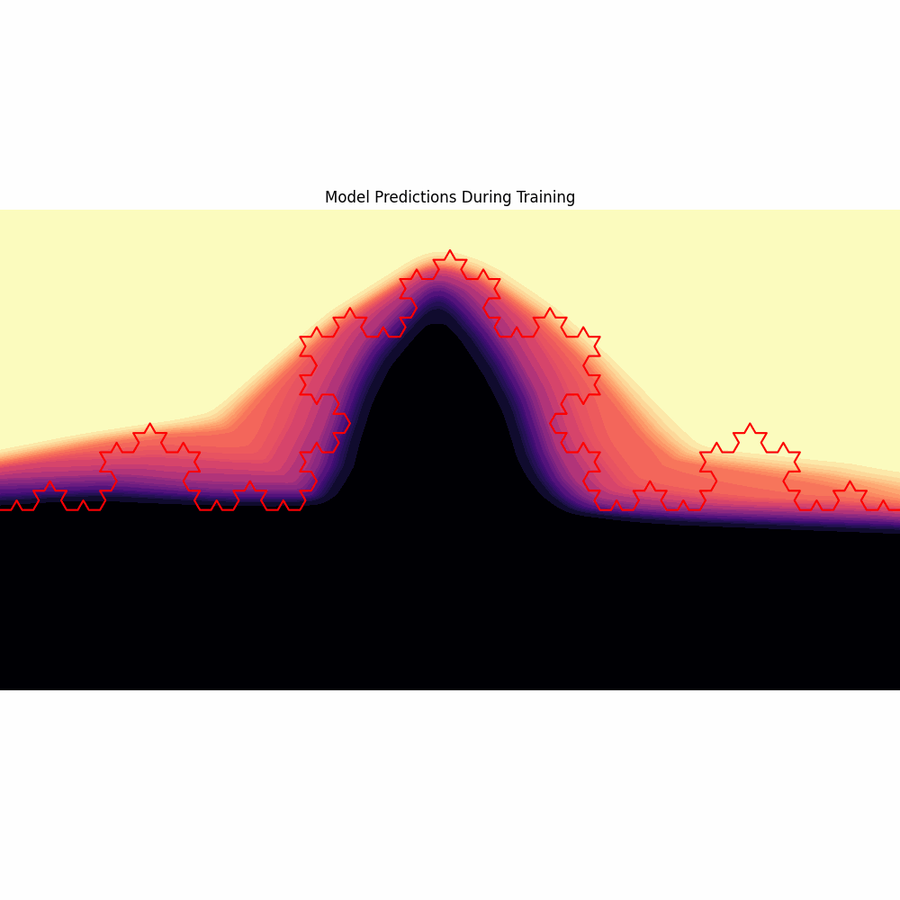

# Mandelbrot

Learning fractals

The idea here is to learn to what degree whether neural networks can learn the underlying rules of fractals, rather than just approximating their outline. Because some of these patterns are infinitely self-similar, we would expect a successful model to infinitely predict correctly.

Some approaches:
- Simple MLP
- Adaptive computation time neural network
- Neural turing machine
- Something more symbolic / rigid

Some other notes:
- It would be interesting to provide training data which only defined the pattern up to a certain recursion depth, and see if any model can accurately separate points which define the pattern at greater depths.
- I want to see what priors we can encode, and particularly any priors that may be general to other reasoning tasks. We also don't want to help the model too much by making it too specific to the problem we know is at hand.
